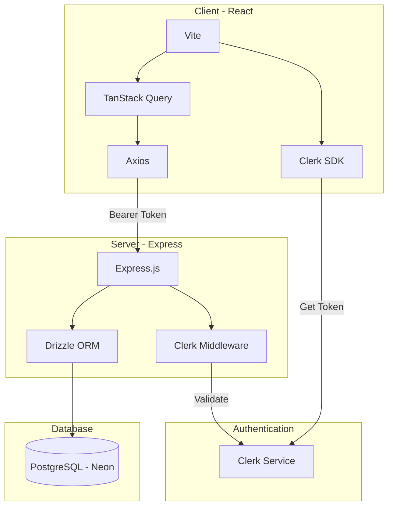
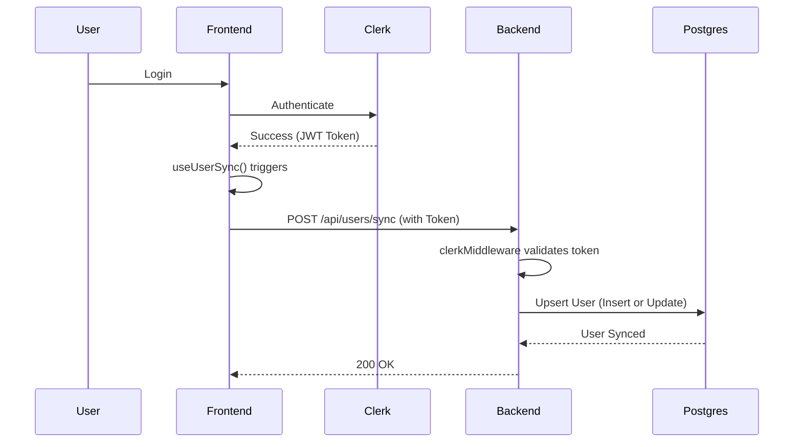

# 🚀 ProductHub

ProductHub is a modern, full-stack application designed to manage products and community discussions. It features a robust backend API and a dynamic frontend, built with a state-of-the-art tech stack.

---

## 🏗️ System Architecture

This diagram shows how the different parts of ProductHub communicate:



---

## 🛠️ Core Concepts & Tech Stack

### 1. ⚡ TanStack Query (React Query)
**Why we use it:**
In modern React apps, managing "server state" (data from an API) is hard. TanStack Query handles:
- **Caching**: Data is stored so navigating back to a page is instant.
- **Loading States**: Automatically gives us `isLoading` and `isPending` flags.
- **Auto-Refetching**: Keeps data fresh without manual refreshes.

**Example:**
```javascript
const { data, isLoading } = useQuery({ 
  queryKey: ['products'], 
  queryFn: getAllProducts 
});
```

### 2. 🔐 Authentication (Clerk)
We use **Clerk** for secure, hassle-free authentication.
- **Frontend**: The `useAuth` hook provides tokens and user status.
- **Backend**: The `clerkMiddleware` protects routes.
- **User Sync**: When a user signs in, we automatically "sync" their data to our Postgres database using a custom hook (`useUserSync`).

### 3. 🗄️ Database (PostgreSQL & Drizzle)
PostgreSQL is our "brain." It stores users, products, and comments. 
- **Drizzle ORM**: Allows us to write TypeScript code instead of raw SQL strings, making the database type-safe.
- **Relationships**: A `User` can have many `Products`, and a `Product` can have many `Comments`.

---

## 🔄 User Sync Flow

When a user logs in via Clerk, we need to make sure they exist in our local database so we can link them to products they create.



---

## 🚀 Getting Started

### Prerequisites
- Node.js (v18+)
- PostgreSQL (Neon.tech recommended)
- Clerk Account

### Installation

1. **Clone the Repo**
2. **Server Setup**:
   ```bash
   cd Server
   npm install
   # Add .env (DATABASE_URL, CLERK_SECRET_KEY, etc.)
   npm run dev
   ```
3. **Client Setup**:
   ```bash
   cd Client
   npm install
   # Add .env (VITE_API_URL, VITE_CLERK_PUBLISHABLE_KEY)
   npm run dev
   ```

### 🛠️ Database Commands
- `npm run db:push`: Sync your schema changes directly to the DB.
- `npm run db:studio`: Open a GUI to view your database records.

---

## 📁 Project Structure

- **`/Client`**: React frontend with Vite.
  - `/src/hooks`: Custom logic for Auth and API state.
  - `/src/lib`: Shared Axios configuration.
- **`/Server`**: Express API.
  - `/src/db`: Database schemas and queries.
  - `/src/routes`: API endpoints.
  - `/src/controllers`: Business logic.

---

## 📝 License
ISC License