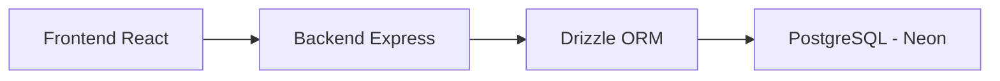

# PostgreSQL & Drizzle ORM: The Database Guide

Welcome to the PostgreSQL learning journey! This guide explains how PostgreSQL works and how it is implemented in your **ProductHub** project.

## 1. What is PostgreSQL?

**PostgreSQL** (often called Postgres) is a powerful, open-source **Relational Database Management System (RDBMS)**. It uses **SQL** (Structured Query Language) to manage data.

### Core Relational Concepts:
- **Tables**: Similar to spreadsheets. Each table represents an "Entity" (like `users` or `products`).
- **Rows**: Individual records in a table (e.g., one specific user).
- **Columns**: Attributes of the data (e.g., `email`, `createdAt`).
- **Primary Key**: A unique ID that identifies each row (In your project, we use Clerk IDs for users and UUIDs for products).
- **Foreign Key**: A column that creates a link between two tables.

---

## 2. Project Architecture

Your project uses **Drizzle ORM** to talk to PostgreSQL. Instead of writing raw SQL strings, you write TypeScript code that Drizzle translates into SQL.



---

## 3. The Schema (`schema.ts`)

The schema is the "blueprint" of your database. Let's look at how your tables are linked:

### The `users` table
This stores information about everyone who logs in via Clerk.
```typescript
export const users = pgTable("users", {
    id: text("id").primaryKey(), // Clerk User ID
    email: text("email").notNull().unique(),
    name: text("name"),
    imageUrl: text("image_url"),
});
```

### The `products` table (One-to-Many Relationship)
Every product "belongs to" a user. We link them using `userId`.
```typescript
export const products = pgTable("products", {
    id: uuid("id").defaultRandom().primaryKey(),
    title: text("title").notNull(),
    userId: text("user_id").notNull().references(() => users.id, { onDelete: "cascade" }),
});
```
> [!TIP]
> `onDelete: "cascade"` means if you delete a user, Postgres will automatically delete all of their products for you!

---

## 4. Understanding Queries (`queries.ts`)

### 1. The "Upsert" (Create or Update)
This is the most advanced query in your project. It prevents duplicate users.

```typescript
export const upsertUser = async (data: NewUser) => {
  const [user] = await db
    .insert(users)
    .values(data)
    .onConflictDoUpdate({
      target: users.id, // If ID already exists...
      set: {            // ...update these fields
        email: data.email,
        name: data.name,
      },
    })
    .returning(); // Return the user object after saving
  return user;
};
```

### 2. Fetching with Relations
In SQL, we use **JOINs** to get data from multiple tables. Drizzle makes this easy:

```typescript
export const getProductById = async (id: string) => {
  return await db.query.products.findFirst({
    where: eq(products.id, id),
    with: {
      user: true,      // Automatically joins the user who owns the product
      comments: true,  // Automatically joins all comments for this product
    },
  });
};
```

---

## 5. Why PostgreSQL?

1.  **Strict Data Types**: If a column is a `timestamp`, Postgres won't let you accidentally save a string like "tomorrow".
2.  **ACID Compliance**: This ensures that your database transactions are processed reliably. If your server crashes in the middle of a save, Postgres ensures the data isn't corrupted.
3.  **Powerful Search**: PostgreSQL has built-in Full Text Search capabilities, which is great for building search bars in projects like ProductHub.

---

## 6. Helpful SQL Commands (The "Under the Hood" Stuff)

Even though you use Drizzle, it's helpful to know the SQL Drizzle generates:

| Operation | SQL Example |
| :--- | :--- |
| **Create** | `INSERT INTO products (title) VALUES ('Cool Gadget');` |
| **Read** | `SELECT * FROM products WHERE id = '...';` |
| **Update** | `UPDATE products SET title = 'New Name' WHERE id = '...';` |
| **Delete** | `DELETE FROM products WHERE id = '...';` |

---

### Next Steps for Learning:
- Try adding a new column to a table in `schema.ts`.
- Run `npx drizzle-kit push` to apply the changes.
- Notice how Postgres handles the update instantly!
